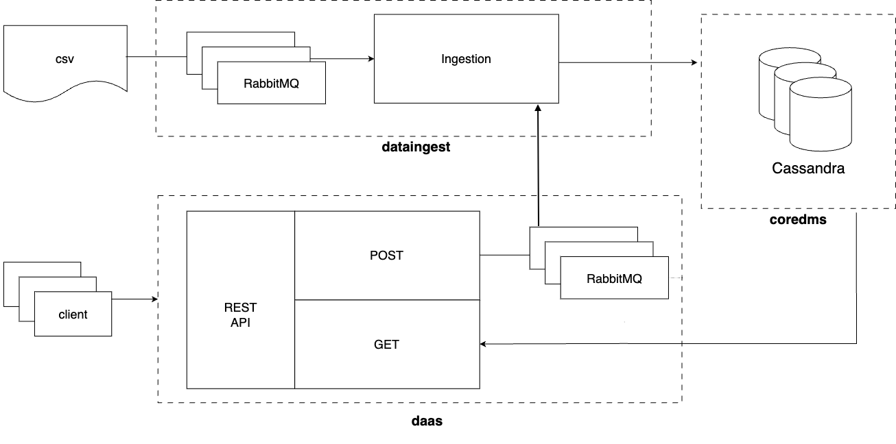

# Report

## Design
For simplicity, I did not implement my platform in any cloud, I used docker containers connected through a docker network.

The following diagram shows my intended design:

I am using the Reddit Comments dataset from Kaggle. The link provided in the description was not available,
but Kaggle published the same dataset [here.](https://www.kaggle.com/datasets/kaggle/reddit-comments-may-2015)

The dataset is a sqlite file, I used TablePlus to read the file and extract different samples to test.
The whole file is 32 GB. I uploaded a small csv sample (1000 rows) [here.](../data/small_sample_reddit_comments.csv)

### mysimbdp-coredms
For mysimbdp-coredms I used a Cassandra Cluster following what we have learnt in the tutorial. 
I chose it because it is easy to set up in a dockerized environment and offers great support for big amounts of data.

### mysimbdp-dataingest

For mysimbdp-dataingest I used RabbitMQ and created a docker container that acts as a producer, it reads data from a csv file,
selects only relevant columns and publish them to a queue called *"comments"*.

The ingestion part is done by multiple consumers (in the docker-compose file I have set a number of 4 consumers, but can be more).
When a consumer gets a message it is stored in the Cassandra database.

### mysimbdp-daas

mysimbdp-daas is a simple REST API in Flask and RabbitMQ that receives requests from clients.
* A POST request produces a message to the same queue that consumers from dataingest are using.
* A GET request asks the database for data and shows it in json format.

## Answers to the Questions

### Part 1

1. * Application domain: Reddit comments; evaluate which users have more up votes in different subreddits to identify potential candidates for marketing purposes.
   * Data types: A single unit of data includes: text, timestamps and integers. Text for the name of the author, subreddit and content of the comment.
   Timestamp for the creation date of the comment. Integers for the number of up votes and the score of the comment.
   * Reddit is a popular platform which thousands of people use. The dataset used in this design was originally filled using the Reddit API.
   Many users are writing comments every second, resulting in a huge quantity of data to evaluate.
2. * The design and interactions of my platform are explained in the previous section.
   * I did not develop Docker, Docker Compose, Cassandra, RabbitMQ or Python for my platform. I used their official distributions.
3. Cassandra is configured as a cluster:
   * It has 2 data centers (DC1 and DC2)
   * 3 nodes: 2 nodes in DC1 and 1 node in DC2.  
   * It is using a replication factor of 3 and the simple strategy.
   * Consistency is set to Quorum.
   
   This configuration provides good consistency and availability and helps to prevent single-point-of-failure; however, there is room for improvement, for
   example having the datacenters in different machines instead of one, and having more nodes.
4. As mentioned in the previous answer, the replication level is 3, which is the same as the number of nodes, to improve it I should add 
   more nodes. The replication level should be more than one and less than the total number of nodes.
5. I would do the following: 
   * Add a RabbitMQ cluster as well, since it will help to avoid failures.
   * Have more consumers, currently I have 4 consumers, increasing to maybe 10 or more would be better.
   * Scale Cassandra horizontally by adding more nodes, and have them in different locations.

### Part 2

1. My example schema is the following:
   > comments_by_subreddit
   > - **created_utc** is a timestamp of the creation date of the comment.
   > - **ups** is an integer reflecting the number of up votes of the comment, this is part of the *Primary Key* and acts as a ***Clustering Key***, and retrieves data in descending order.
   > - **subreddit** text, the name of the forum where the comment was posted, this is part of the *Primary Key* and acts as a ***Partitioning Key***.
   > - **id** an alphanumerical string that identifies the comment, this is part of the *Primary Key* and acts as a ***Clustering Key***, and retrieves data in ascending order.
   > - **author** text, the username of the person who wrote the comment 
   > - **score** int, the result of adding up votes and down votes.
   > - **body** text, the content of the comment

   I am using a keyspace called ***reddit***. In Cassandra schemas are designed for specific queries, I have decided to use this schema since it facilitates the "marketing"
   purposes I mentioned in my domain. The schema construction can be seen [here.](../code/coredms/conf_cassandra.cql)
2. * In Cassandra, partitions are made by partition keys which are used to distribute data evenly among the nodes using hashing techniques. My strategy (explained below) works well with my chosen replication
    because Cassandra will internally redirect queries to the correct node using the partition key.
   * My partitioning key is the subreddit of the comment and my clustering keys are the id of the comment and its up votes. I chose this because in Cassandra each table must have only 
   one purpose to make queries respond faster; my combination allows users to find popular unique comments by subreddit.
3. * Atomic data element: reddit comment.
   * [In Cassandra write operations are always sent to all replicas](https://cassandra.apache.org/doc/4.0/cassandra/architecture/dynamo.html#tunable-consistency). To achieve consistency in responses I am using *quorum*, 
   this means the majority of the nodes in both datacenters need to respond.
4. I have tested different ingestion scenarios with variations in the number of nodes and consistency level in Cassandra.

   > **NOTE:** I did not use any tool to test. I changed my docker compose files to have different configurations. 
   > 
   > I created a python [script](../code/coredms/test/insertion_test.py) based on the one showed in the [consistency tutorial](https://version.aalto.fi/gitlab/bigdataplatforms/cs-e4640/-/blob/master/tutorials/consistency/test_consistency_write.py) that runs insertions directly to Cassandra. Then I created a container and run N number of replicas with compose.
   > 
   > All users are using the same data sample (10,000 rows), Cassandra avoids replication of data and will only update a row if a change is detected.
   > 
   > For context, my computer is a MacbookAir with M1 processor and 16 GB of RAM.

   1. **Scenario 1:** *QUORUM consistency*
      > 3 Cassandra nodes, 2 in DC1 and 1 in DC2 (current).
      > - 5 users: writing took 33 seconds on average.
      > - 10 users: writing took 47 seconds on average.
      > - 100 users: 57 users were able to write all data successfully. The rest timed out. It took 265 seconds on average for each of these users to write.

      > 5 Cassandra nodes, 2 in DC1 and 3 in DC2.
      > - 5 users: writing took 51 seconds on average.
      > - 10 users: only 5 users were able to insert all data. Writing took 50 seconds on average.
      > - 100 users: Two nodes restarted. None of the users was able to insert any data.
   2. **Scenario 2:** *ALL consistency*
      > 3 Cassandra nodes, 2 in DC1 and 1 in DC2.
      > - 5 users: writing took 32 seconds on average.
      > - 10 users: writing took 36 seconds on average.
      > - 100 users: 49 users were able to write all the data. It took them 165 seconds on average.

      > 5 Cassandra nodes, 2 in DC1 and 3 in DC2.
      > - 5 users: writing took 52 seconds on average.
      > - 10 users: One node restarted, all users failed.
      > - 100 users: 1 node went down, 1 restarted. All users failed.
   3. **Scenario 3:** *ONE consistency*
      > 3 Cassandra nodes, 2 in DC1 and 1 in DC2.
      > - 5 users: writing took 23 seconds on average.
      > - 10 users: writing took 27 seconds on average.
      > - 100 users: 41 users were able to send all the data. It took between 58-115 seconds to complete.

      > 5 Cassandra nodes, 2 in DC1 and 3 in DC2.
      > - 5 users: writing took 45 seconds on average.
      > - 10 users: 8 users sent all data. Writing took 108 seconds on average.
      > - 100 users: 1 node down, 1 restarted. None of the users was able to send the data.
   * Reflection on the results: These direct insertions show that not always having more nodes means higher availability. 
      Consistency ONE was the fastest in 3 nodes, getting 5 to 41 concurrent users. However, this
      does not mean is the best choice because we will be getting acknowledment of only one node, and maybe the other ones
      don't replicate the data correctly. I would stick with my initial configuration with QUORUM since consistency set to ALL is too consuming.
5. * Adding more nodes to my cluster would help to increase the capacity of the database.
   * If my platform were implemented in a different environment, adding a load balancer would also help to distribute the requests more evenly.
   * Automatic scaling would be also an improvement.
   * Reflecting on my dataingest, even if I didn't test it simultaneously, I would change it to Kafka since it's more adequate to this kind of implementations.

### Part 3

1. * **Metadata**. These are just ideas of what I could use as metadata: 
      > Name: a name for the dataset 
      > 
      > Description: a description of the data included in the dataset.
      >
      > Size: The size of the dataset
      > 
      > Owner: the tenant that created the dataset
      > 
      > Last updated: The last date in which the dataset received information.
   * **Example**: a user wants to find a dataset that contains comments on a specific subreddit. By searching the metadata 
   for the dataset, they can quickly find the dataset they need. If, for example, the name or description contain information 
   about the subreddit of each dataset, the user can search for all datasets that contain information about a subreddit, and then choose the one that best fits their 
   needs based on other metadata information, like the size, or how often the dataset is updated.
2. <mark>to complete</mark>
3. <mark>to complete</mark>
4. <mark>to complete</mark>
5. <mark>to complete</mark>

### Test results
